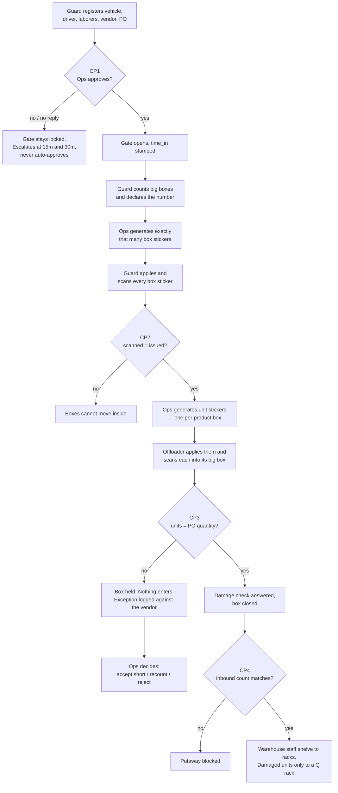
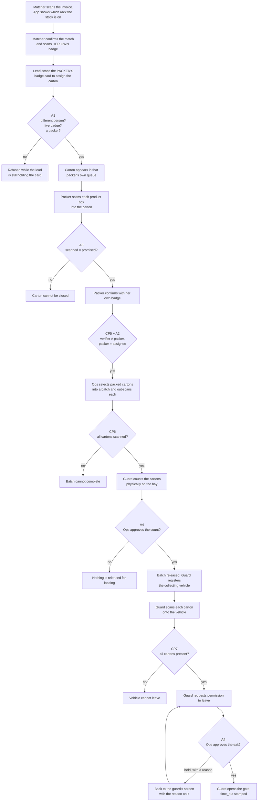

# The Warehouse Workflow

What happens, in order, from a truck arriving at the gate to a different truck
leaving with packed cartons — who does each step, what the software refuses, and
where that refusal lives.

This is the operational companion to [DECISIONS.md](DECISIONS.md), which explains
*why* each rule is shaped the way it is. Where the two disagree, the database
wins: every hard stop below is a Postgres trigger or constraint, not a check in a
request handler.

---

## Vocabulary

The floor and the schema use different words for the same things. Both appear in
this repo, so here is the mapping:

| On the floor | In the code |
|---|---|
| big box, carton off the truck | `boxes` — sticker type `box` |
| small box, individual product box | **`units`** — sticker type `unit` |
| carton going out to a customer | an `invoice` plus its `packing_record` |
| batch | `batches` — a group of packed cartons released together |
| admin (who approves the gate) | the `ops_manager` role; Admin gets it at T+30m escalation |

"Admin" in conversation usually means Boopathi, the Ops Manager. The `admin`
role in the software is narrower: it provisions accounts and issues badges, and
those are the two things Ops deliberately cannot do.

---

## The eleven hard stops

Nothing in this list can be overridden from the application. Each is enforced in
the database, which is what makes "zero manual overrides" (PRD §11) a property
rather than a policy.

| # | Where | The rule | Enforced by |
|---|---|---|---|
| **CP1** | Gate entry | Ops must approve before the gate opens, and the guard who filed it cannot approve it | `fn_gate_entry_guard` (0004) |
| **CP2** | Box count | Box stickers scanned must equal stickers issued | `fn_gate_entry_guard` (0004) |
| **CP3** | Unit count | Units scanned into a box must equal the PO quantity | `fn_box_transition_guard`, `fn_scan_apply` (0004) |
| **CP4** | Inbound reconciliation | Warehouse count must equal the inbound team's count before putaway | `fn_putaway_guard` (0007) |
| **CP5** | Packing | Invoice verified by one person, packed by a different one | `fn_packing_guard` (0009) |
| **CP6** | Out-scan | Every carton assigned to a batch must be physically scanned | `fn_batch_release_guard` (0018) |
| **CP7** | Gate exit | Every released carton must be verified onto the vehicle | `fn_pickup_guard` (0018) |
| **A1** | Packing assignment | A carton goes to a named packer, who is not the verifier, holds a live badge, and is not already packing something closed | `fn_packing_assignment_guard` (0017) |
| **A2** | Packing attribution | The pack must be recorded against the person it was assigned to | `fn_packing_matches_assignment` (0017) |
| **A3** | Product reconciliation | Product boxes scanned into a carton must equal what the invoice promises | `fn_packing_units_complete` (0019) |
| **A4** | Outbound approvals | A batch is not released without an approved carton count; a vehicle does not leave without a recorded Ops approval | `fn_batch_release_guard`, `fn_pickup_guard` (0018) |

CP1–CP7 are PRD §4. A1–A4 were added in Phase 5, after walking the process
aloud surfaced four steps the floor had always performed and the software had
never modelled.

The migration named is the one holding the **current** definition. Several of
these functions are defined in an early migration and replaced by a later one —
`fn_batch_release_guard` first appears in 0004, is extended in 0009, and now
lives in 0018. Grepping the earliest match gets you a superseded version.

---

## Inbound: truck arrives



### Step by step

| Step | Who | Screen | Notes |
|---|---|---|---|
| 1 | Security Guard | *Gate Entry* | Driver and laborers, mobiles, vehicle, vendor, PO. Identity photo on first visit only, re-captured after 180 days |
| 2 | Ops Manager | *Approvals* | **CP1.** A guard cannot approve their own entry. At T+15m it escalates to a backup Ops Manager, at T+30m to Admin. The timer escalates the *notification*, never the decision |
| 3 | Security Guard | *Trucks → Count boxes* | Declares how many big boxes are on the truck |
| 4 | Ops Manager | same page | Generates a sticker sheet with *exactly* that many QR stickers, each backed by a `stickers` row |
| 5 | Security Guard | same page | Applies one per box, scans each. **CP2** — a re-scan is rejected, not double-counted |
| 6 | Ops Manager | *Scan units* | Generates unit stickers, one per product box, from the PO quantity |
| 7 | Offloading Team | *Scan units* | Scans each product box into its big box. **CP3.** Over-scan is refused outright; under-scan holds the box |
| 8 | Ops Manager | *Exceptions* | Decides a held box: `accept short`, `recount`, or `reject`. Scanned units are kept as evidence either way |
| 9 | Inbound Team | *Verify inbound counts* | **CP4.** Their own system's count against the warehouse's |
| 10 | Warehouse Staff | *Putaway* | Scans a rack code. A box may be split across racks; damaged units only into a quarantine (`Q-`) rack |
| 11 | Warehouse Staff | *Stock* | Where everything ended up, grouped by SKU |

---

## Outbound: order goes out



### Step by step

| Step | Who | Screen | Notes |
|---|---|---|---|
| 12 | Invoice Matcher | *Matching* | Scans the invoice number; the page says which rack the stock is on. Confirms, then scans **her own** badge. A packer's badge is refused here |
| 13 | Matcher, packer or Ops | *Packing* | Scans the **packer's badge card** to assign the carton. **A1.** Reassignment keeps both records, so "who had it at 14:20" stays answerable |
| 14 | Packing Lady | *Packing → My cartons* | Scans each product box into the carton. **A3.** A double scan, a big-box sticker, a wrong-SKU product and a box that never arrived are each refused with a distinct message |
| 15 | Packing Lady | same page | Confirms with **her own** badge. **CP5** (verifier ≠ packer) and **A2** (packer = assignee) |
| 16 | Ops Manager | *Out-Scan* | Selects packed cartons into a batch, scans each carton's invoice label. **CP6.** Cartons cannot leave a batch once scanning starts |
| 17 | Security Guard | *Carton Count* | Types how many cartons are physically on the bay. The system's number appears only *after* they commit to theirs |
| 18 | Ops Manager | *Approvals* | **A4.** Approves or rejects the count. The guard who counted cannot approve it, and the approver must be Ops |
| 19 | Ops Manager | *Out-Scan* | Releases the batch. Invoices close — the floor can no longer act on them |
| 20 | Security Guard | *Pickup* | Registers the collecting vehicle. A driver who also delivered is recognised and not re-photographed |
| 21 | Security Guard | *Pickup* | Scans each carton onto the vehicle. **CP7** |
| 22 | Security Guard | *Pickup* | Requests permission to leave. The gate does **not** open yet |
| 23 | Ops Manager | *Approvals* | **A4.** Approves, or holds with a reason that appears on the guard's screen |
| 24 | Security Guard | *Pickup* | Opens the gate. `time_out` stamped. Approving does not open the gate — the guard does, so the act stays attached to the person standing there |

---

## Who can see what

Navigation is derived from one table, `PAGE_ACCESS` in
`backend/app/api/v1/meta.py`. It decides what is *shown*; every endpoint
re-checks the role, and RLS re-checks it again in the database.

| Role | Pages |
|---|---|
| Security Guard | Gate Entry, Trucks, Pickup, Carton Count |
| Ops Manager | everything operational — dashboard, approvals, stickers, scanning, exceptions, reports, putaway, stock, matching, packing, out-scan, pickup, carton count |
| Offloading Team | Scan units, Exceptions, Putaway |
| Inbound Team | Reconciliation |
| Warehouse Staff | Putaway, Stock |
| Invoice Matcher | Matching, Stock |
| Packing Lady | Packing |
| Admin | everything Ops has, plus **Staff** |

Two capabilities are Admin-only and deliberately withheld from Ops:
provisioning accounts and issuing badges. An Ops Manager who could issue a badge
could manufacture the second person CP5 requires.

---

## Badges

A badge records **who handled an item**. It is not a login — the station tablet
is already signed in, and the badge distinguishes which of several matchers or
packers is standing at it.

The invariant: **no operation tells anyone the code of a badge that is currently
in someone's pocket.**

- `profiles.badge_code` is revoked from `authenticated` at the column level
- it is redacted out of the audit trail at write time
- badges are resolved one-way, through `resolve_badge_holder(code)` — code in,
  person out, never the reverse
- exactly one operation returns a code: **issuing** one, to the Admin who asked,
  for a badge minted in that request

So "reissue" means *replace*. A lost badge is never looked up, and the found
badge stops working the moment the replacement is printed.

Scanning a colleague's card to assign them a carton is consistent with all of
this: the card is physically present, which is the intended use. **Physical
custody of the badge is the control.**

---

## What happens when something goes wrong

| Situation | What the system does |
|---|---|
| Count mismatch at any control point | Refuses to proceed, and **writes**: the box is held, an exception is logged against the vendor and PO, Ops is alerted. This is why those endpoints answer `409` with a full body rather than raising — raising would roll back the record that makes the hold enforceable |
| Scanner rejects a code | The rejection is *recorded* with a reason, so "the scanner didn't work" stays a claim that can be checked |
| Device goes offline | Scans queue in IndexedDB and replay on reconnect. Every scan carries a device-minted id with a unique constraint, so replaying is a no-op |
| A mistake needs correcting | Nothing is deleted. Corrections are reversing entries or superseding rows, with the original still visible and still in reports |
| Ops does not respond to a gate approval | Escalates at 15 and 30 minutes and flags `sla_breached`. Never auto-approves |
| Nobody notices the retention job stopped | `overdue` on the *Staff* screen climbs. Nothing else would report it, because not deleting breaks nothing |

---

## Where to look in the code

```
supabase/migrations/    the guarantees. 0004 and 0007-0009 are CP1-CP6,
                        0012 is CP7, 0016-0019 are A1-A4
backend/app/services/   the business flows, and the friendly wording for a refusal
backend/app/api/v1/     routes and role guards
backend/app/worker.py   SLA escalation, email, identity photo retention
frontend/src/pages/     one page per screen named above
docs/DECISIONS.md       why each rule is shaped the way it is
```

The service layer checks the same rules the database does. That is not
duplication for its own sake: the service produces the sentence an operator can
act on, and the database is what makes the rule a guarantee. If they ever
disagree, the database is right.
